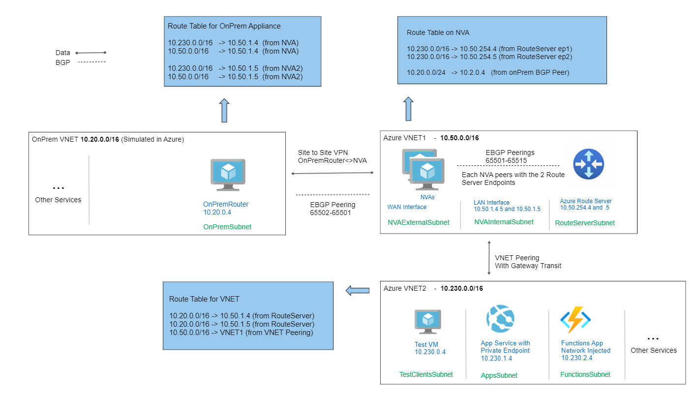

# RouteServerLab
A deployment of Route server and several supporting components to test the capabilities of [Azure Route Server](https://learn.microsoft.com/en-us/azure/route-server/overview)



This deployment includes

- A Hub Virtual Network
- A Spoke Virtual Network
- Azure Route Server
- Windows Server VMs acting as NVAs - High Availability pair
- Windows Server VM acting as an OnPremises Gateway Appliance
- Windows Server VM acting as a Web Server
- Azure Load Balancer - Internal - Configured in front of the Web Server
- App Service Web app - Network Integrated and with Private Endpoint
- Azure Functions App - Network Integrated
- Azure Kubernetes Service - Using Azure CNI

Automatically configured

- Hub an Spoke VNET Peering, and Gateway transit configuration
- NVAs including BGP Peerings
- Route Server BGP Peerings with NVA
- OnPrem Router Site to Site VPN and BGP Peering
- Sample Azure Functions App
- Sample AKS App


## Deployment Instructions

- Download and Install [Terraform](https://developer.hashicorp.com/terraform/downloads)

- Download and Install [Azure CLI](https://learn.microsoft.com/en-us/cli/azure/)

- Clone this repository and change directory
   ```
   git clone https://github.com/luisfeliz79/AzureContrib.git
   cd AzureContrib/RouteServerLab
   ```

- Run these commands
    ```
    az login
    terraform init
    terraform plan -out my.plan
    terraform apply my.plan
    ```

   Note: You will be prompted to specify:
   - An Azure region name (location) to deploy to
   - A Password for the virtual machines (default user is LabAdmin)

### Customizing the deployment
- Several PaaS components are deployed as part of the sandbox. Any terraform plan files (.tf) named with "Optional_" can be removed if desired.


### Cleaning up

- Run these commands
    ```
    az login
    terraform plan -destroy -out my.plan
    terraform apply my.plan
    ```

    Note: If this process does not complete, it is possible other resources have been added to the Resource groups. Make sure to delete those manually.


### Need a list of Region names?
Run this:
```
az account list-locations -o table
```


## Connecting to the Lab
- The Public IP of the following VMs will be provided as part of the plan's output
    - OnPremRouter
    - NVAs 
- Remote desktop is exposed on port 22389. To connect, run this:
   ```
   mstsc -v <public-ip>:22389
   ```

