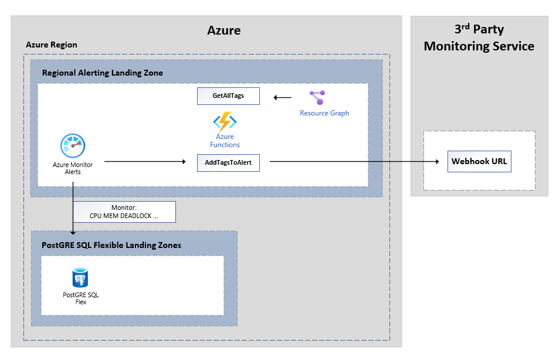

# Enrich Azure Monitor metric alerts with the Resource Tags

## How it works

- Azure Monitor Alerts triggers, and has an action group for running an Azure Function AddTagsToAlert
- The AddTagsToAlert function extracts the impacted resource Id from the alert payload.
- A lookup is done for tags for the impacted resource Id, this is done from a cached Json file which contains all PGFLEX resource IDs, and tags.
- The AddTagsToAlert function inserts the tags into the payload.
- The AddTagsToAlert function POSTs the updated alert payload to the 3rd party Monitoring service via its Webhook URL.

## How are the tags retrieved and cached?

- There is a secondary function called GetAllTags, which runs every 5 minutes.
- The GetAllTags  function uses a managed identity to access the Azure Resource graph service, to retrieve all tags related to PostgreSQL Flex servers.
- The GetAllTags function writes the result to the cached Json file.

## Requirements

- Assign a User Assigned Managed Identity (System Assigned can be used as well)
- Permission the managed identity for “Reader” access to the Resource Groups, Subscriptions OR Management groups that contain the PGFLEX Instances
- Configure the following Configuration settings on the Function App
-     Target_Webhook =  “<the https endpoint for the 3rd party monitoring service, ex. pager duty>”
-     MSI_CLIENT_ID = “<the client id of the user assigned managed identity>”

