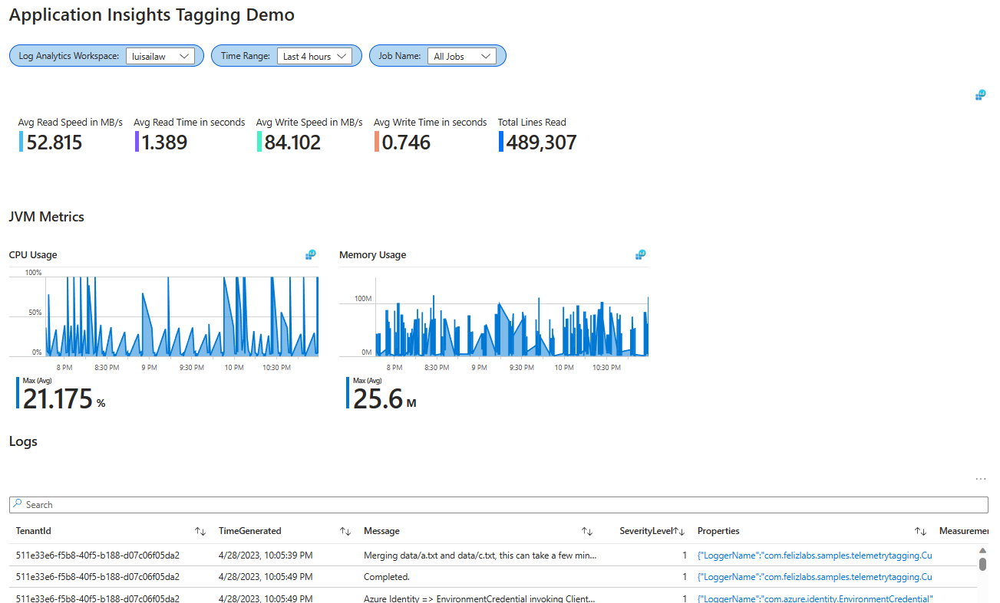

# App Insights with Tags demo

## Description

- This sample showcases auto-instrumentation and tagging features of App Insights for Java. It uses the Application Insights Java agent, which automatically ingests data from popular libraries, see [here for more info](https://learn.microsoft.com/en-us/azure/azure-monitor/app/opentelemetry-overview)
- The demoapp runs emulates a data process and includes attribute "jobName" for each run.   After serveral runs, you can examine metrics and traces at the job level using the included workbook.

- Take a look at the [App Insights configuration](./applicationinsights.json)
  - The inheritedAttributes configuration directive should include a list of attributes you want to include on ingested telemetry. These need to match what has been defined as tags in the code.
        This is related to [this feature](https://learn.microsoft.com/en-us/azure/azure-monitor/app/java-standalone-config#inherited-attribute-preview)

- Application Insights will automaticall ingest:
    - Logback traces
    - Open Telemetry Libraries instrumentation
    - Micrometer instrumentation using the globalRegistry
    - And much more -> [More info](https://learn.microsoft.com/en-us/azure/azure-monitor/app/java-standalone-config)

- The tag data can be used with KQL Queries and Workbooks/Dashboard visualizations.

## Running the demo app

## Pre-reqs
- Create an App Insights (workspace based)
- A Service principal with a Secret credential
- Create an Azure Storage Account with Hierarchical namespace
- Give the service principal "Storage Blob Data Contributor" RBAC permssision to the storage account
- Visual Studio code

### Compile
    
    cd .\appinsights-and-tagging-demo\demoapp 
    mvn package
    mvn install dependency:copy-dependencies
    
### Required variables
    
    $ENV:AZURE_TENANT_ID = "xxx"
    $ENV:AZURE_CLIENT_ID = "xxx"
    $ENV:AZURE_CLIENT_SECRET = "xxx"
    $ENV:STORAGE_ACCOUNT_NAME = "<storage-account-name>"  
    

### Run
    
    cd .\appinsights-and-tagging-demo
    java -cp .\demoapp\target\dependency\* -jar .\demoapp\target\felizlabs-samples-appinsights-telemetry-tagging-1.0.jar -javaagent:applicationinsights-agent-3.4.12.jar
    

### Installing the included Workbook

- In the Azure Portal, use the top search bar to search for "Workbooks"
- Click Create Workbook
- Click New
- Click on the Advanced Editor Icon </>
- Copy and paste the contents of [workbook.json](./workbook/workbook.json)
