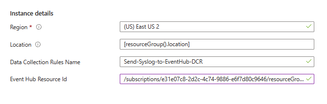

# ARM template for Data Collection Rule which sends data to Event Hub

## Instructions

- In the Azure Portal, search for "Deploy a custom template"

- Click on "Build your own template in the editor"

- Copy and paste the contents of the [template.json] file into the editor, and click "Save"

- Fill in the parameters as described below

    **Location**: The Azure region where you want to deploy the resources, leave as is if you are unsure

    **Data Collection Rule Name**: The name of the data collection rule, this will be used to name the resources

    **Event Hub Resource Id**: The resource id of the event hub you want to send the data to
    
    Ex: /subscriptions/xxxxxx/resourceGroups/xxxxxx/providers/Microsoft.EventHub/namespaces/my-eventhub-namespace/eventhubs/my-eventhub

    

- Click "Review + Create"
