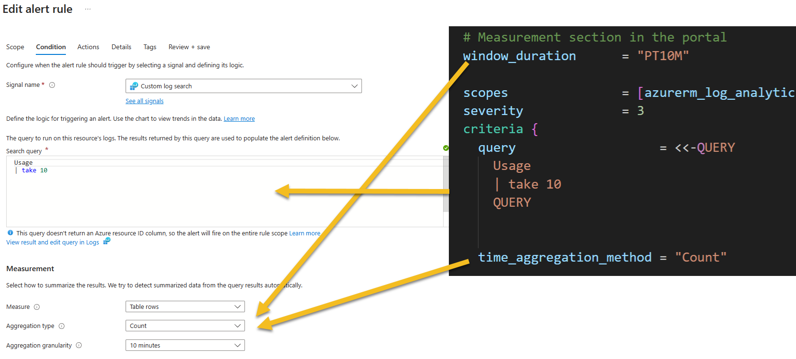
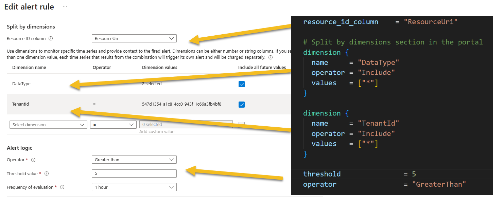
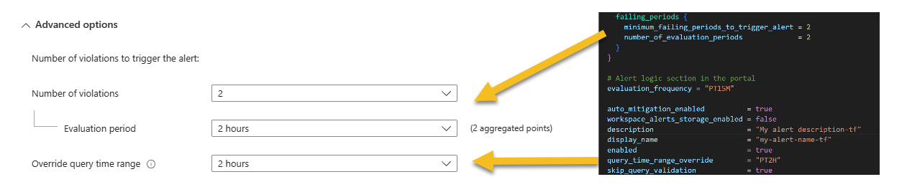
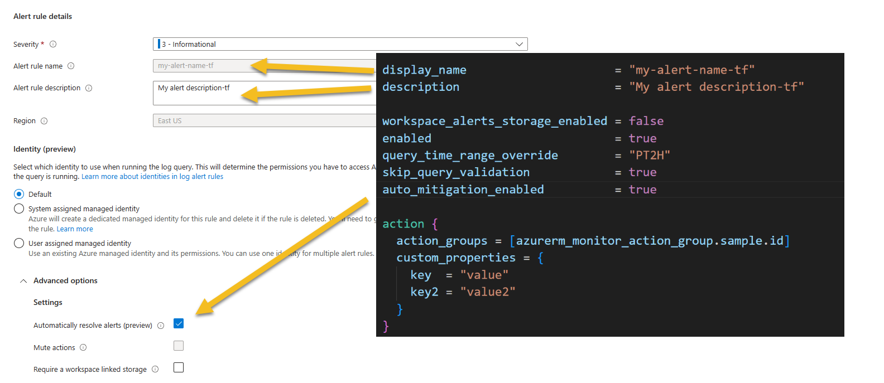

# Deploy Azure Monitor Alerts v2 with Terraform

## Azure Monitor Alert attribute mapping






## Create a Custom Search - KQL based alert
```bash
resource "azurerm_monitor_scheduled_query_rules_alert_v2" "sample" {
  name                = "sample-kql-query-alert-resource-name"
  location            = azurerm_resource_group.alert_rg.location
  resource_group_name = azurerm_resource_group.alert_rg.name
  
  # Measurement section in the portal
  window_duration      = "PT10M"
  
  scopes               = [azurerm_log_analytics_workspace.law.id]
  severity             = 3
  criteria {
    query                   = <<-QUERY
      Usage 
      | take 10
      QUERY
    
    
    time_aggregation_method = "Count"


    resource_id_column    = "ResourceUri"
    
    # Split by dimensions section in the portal
    dimension {
      name     = "DataType"
      operator = "Include"
      values   = ["*"]
    }

    dimension {
      name     = "TenantId"
      operator = "Include"
      values   = ["*"]
    }

    threshold               = 5
    operator                = "GreaterThan"

    failing_periods {
      minimum_failing_periods_to_trigger_alert = 2
      number_of_evaluation_periods             = 2
    }
  }

  # Alert logic section in the portal
  evaluation_frequency = "PT15M"

  display_name                     = "my-alert-name-tf"
  description                      = "My alert description-tf"

  workspace_alerts_storage_enabled = false
  enabled                          = true
  query_time_range_override        = "PT2H"
  skip_query_validation            = true
  auto_mitigation_enabled          = true

  action {
    action_groups = [azurerm_monitor_action_group.sample.id]
    custom_properties = {
      key  = "value"
      key2 = "value2"
    }
  }

  tags = {
    key  = "value"
    key2 = "value2"
  }
}
```

## Complete plan
[main.tf](./main.tf)