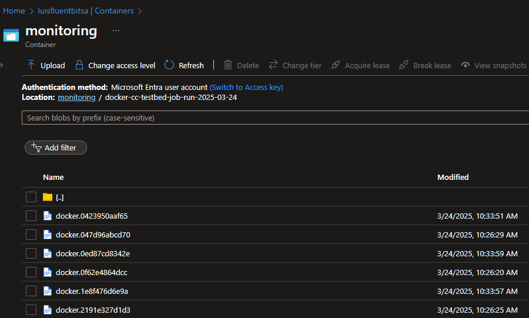

# Using Fluent Bit to send logs to Azure Blob Storage

### Notes
- This is an open source community solution, supported by the community directly. Microsoft Support would not be able to assist with this solution, as it is not a Microsoft Managed solution.
- Use a separate Azure Storage Account for this solution for best performance and security (Separation of duties).
- This solution should be thoroughly tested in a non-production environment before deploying to production.

## Prerequisites
- A VM or VMSS with Managed Identity (preferably with a User assigned identity)
- An Azure Storage Account with a container for storing logs
    - RBAC: VM or VMSS Managed identity -> Storage Blob Data Contributor on the Storage account
    - NETWORK: Private Endpoints config or Storage account account Firewall setup to allow traffic from the VM or VMSS
- Azure CLI installed on the VM or VMSS
- Docker installed on the VM or VMSS
- Fluent Bit Docker image pulled or available for download (ex fluent/fluent-bit)

## Fluent Bit Configuration and Setup
- The following example script will do the following:
    - Create a SAS Token for the storage account based on the managed identity.  This is required by the Fluent-Bit Azure Blob output plugin.
    - Create a Fluent Bit configuration file with all needed details such as Storage account name, SAS token, and container name.
    - Run Fluent Bit with the configuration file

```bash
# Authenticate Azure CLI to Azure using the Managed Identity
az login --identity

# Create a SAS token for the Azure Storage Account
# Based on the Managed Identity for the best security
# This method does NOT require the Azure Storage Account Key
# https://learn.microsoft.com/en-us/azure/storage/blobs/storage-blob-user-delegation-sas-create-cli#create-a-user-delegation-sas-for-a-container

accountName='luisfluentbitsa'
expire_date=$(date -d "+72 hours" +'%Y-%m-%dT%H:%MZ')
permissions='crawl' #(c)reate (r)ead (a)ppend (w)rite (l)ist

fluentbit_sas=$(az storage container generate-sas --permissions $permissions --name "monitoring" --account-name $accountName --expiry $expire_date -o tsv --auth-mode login --as-user)
   # For testing purposes
   # echo $fluentbit_sas


# Construct a directory name based on the Hostname and the date
directory_name="$(hostname)-job-run-$(date +'%Y-%m-%d')"

# Create a Fluent Bit configuration file
# That listens on a TCP socket and writes to Azure Blob Storage
cat <<EOF > fluent-bit.conf

[SERVICE]
    flush     1
    log_level info

[INPUT]
    Name              forward
    Listen            0.0.0.0
    Port              24224
    
    # Adjust these as per your needs
    Buffer_Chunk_Size 1M
    Buffer_Max_Size   6M

[OUTPUT]
    name                  azure_blob
    match                 *
    account_name          $accountName
    auth_type             sas
    sas_token             $fluentbit_sas
    path                  $directory_name
    container_name        monitoring
    auto_create_container off
    tls                   on

EOF

    # For testing purposes
    # cat fluent-bit.conf

# In case it was already running
# sudo docker stop fluent-bit
# sudo docker rm fluent-bit

# Run Fluent Bit with the configuration file

sudo docker run -v ./fluent-bit.conf:/fluent-bit/etc/fluent-bit.conf \
    --name fluent-bit \
    --net host \
    fluent/fluent-bit /fluent-bit/bin/fluent-bit \
    --config=/fluent-bit/etc/fluent-bit.conf
```

## Configuring a Docker instance to use Fluent Bit
- Each docker instance will have it's own log file
- The log filename will be based on the container runtime ID.
- The --log-driver=fluentd option is used to specify the Fluent Bit driver
- The --log-opt tag="docker.{{.ID}}" option is used to specify the tag for the log entry

### Example run command
```bash
sudo docker run \
    --net host \
    --name mycontainer \
    --log-driver=fluentd \
    --log-opt tag="docker.{{.ID}}" \
    mycontainer:latest
```

### Example Storage Account blobs


## References
- [Fluent Bit Documentation](https://docs.fluentbit.io/manual/)
- [Fluent Bit Forward Input Plugin](https://docs.fluentbit.io/manual/pipeline/outputs/forward)

- [Fluent Bit Azure Blob Output Plugin](https://docs.fluentbit.io/manual/pipeline/outputs/azure_blob)
- [Azure Blob Storage User Delegation SAS](https://learn.microsoft.com/en-us/azure/storage/blobs/storage-blob-user-delegation-sas-create-cli#create-a-user-delegation-sas-for-a-container)
- [Azure CLI Storage Reference](https://learn.microsoft.com/en-us/cli/azure/storage/container?view=azure-cli-latest#az-storage-container-generate-sas)
