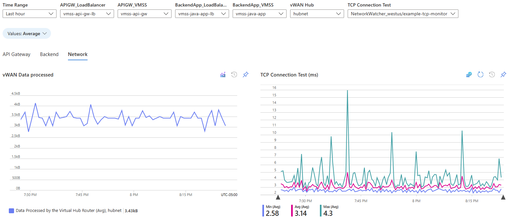

# VMSS and Load Balancers Environment Workbook

## How to install this workbook

- In the Azure Portal, visit the [Workbooks](https://portal.azure.com/#browse/microsoft.insights%2Fworkbooks) blade
- Click on "New workbook"
- Click on "Blank workbook"
- Click on Advanced Editor icon (</>)
- Paste the content of the [workbook](vmss-and-load-balancers-environment-workbook.json)) into the editor. Click on "Apply" to save the workbook